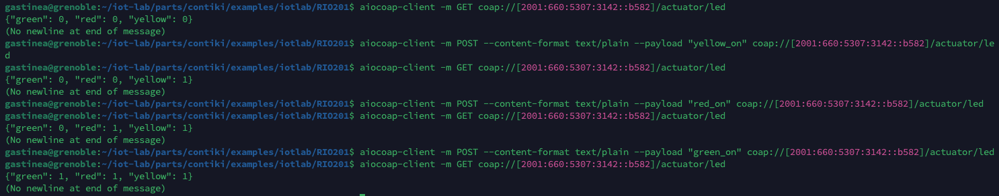

# RIO201 - Arthur Gastineau

## Introduction

L’objectif de ce projet est de concevoir une application IoT innovante exploitant les capacités de la plateforme FIT IoT-LAB pour offrir une automatisation intelligente dans un environnement de travail. Cette application vise à améliorer le confort, l'efficacité énergétique et la sécurité grâce à une gestion proactive de la lumière, de la température et des alarmes d'urgence. Elle repose sur des capteurs pour surveiller en temps réel des paramètres environnementaux clés, tels que la luminosité et la température, et sur des actionneurs pour répondre automatiquement à des changements d’état, tout en intégrant une alarme incendie pour garantir la sécurité des occupants.

### Pourquoi c'est important ?

Avec l'essor des espaces connectés, les applications IoT jouent un rôle crucial dans la transformation numérique des environnements de travail. Cette application spécifique s'inscrit dans une vision de durabilité et d'efficacité énergétique en réduisant les gaspillages liés à l'éclairage ou au chauffage, tout en améliorant le bien-être des employés. Elle répond à un besoin croissant d'automatisation dans les bureaux, usines et bâtiments intelligents.

### Potentiel dans le futur

L'application illustre le potentiel des systèmes IoT dans les bâtiments intelligents. Avec l’intégration de technologies comme l’apprentissage automatique et l’analyse prédictive, ce type d’application pourrait évoluer vers une gestion autonome basée sur des données historiques et des prédictions. Par exemple, les capteurs pourraient anticiper les besoins en chauffage ou en éclairage en fonction des tendances climatiques ou des modèles d’occupation. L’ajout de capteurs avancés et de fonctionnalités de sécurité pourrait également transformer ce type de système en une solution clé pour les bâtiments autonomes et durables du futur.

En outre, la comparaison des performances entre les protocoles CoAP et HTTP dans ce projet met en lumière des choix technologiques critiques pour le déploiement d'applications IoT dans des environnements contraints. Cela pourrait orienter les futures implémentations IoT, en particulier dans des contextes où la latence, la consommation d'énergie et la simplicité des protocoles sont des facteurs déterminants.

## Architecture

L’application IoT est déployée dans un environnement de travail simulé, intégrant des capteurs pour collecter les données, un serveur IoT pour les décisions logiques (jouant le rôle de **client CoAP/HTTP**), et deux actionneurs séparés pour gérer les LEDs d’éclairage, de régulation de température et d’alarme incendie.

### 1. Capteurs

Les capteurs IoT jouent le rôle de **serveurs**, exposant leurs ressources via CoAP ou HTTP pour fournir des données au serveur IoT (client). Ils incluent :

1. **Capteurs de lumière (2 unités) :**
   - Chaque pièce est équipée d’un capteur ISL29020 pour mesurer la luminosité ambiante.
   - **Pièce 1 :** Expose une ressource CoAP accessible via `/sensor/light`.
   - **Pièce 2 :** Expose une ressource HTTP accessible via `/sensor/light`.

2. **Capteur de température (1 unité) :**
   - Un capteur LPS331AP surveille la température pour les deux pièces.
   - Expose une ressource CoAP accessible via `/sensor/temperature`.

### 2. Border Router

Un capteur IoT-LAB M3 est configuré comme **Border Router**, jouant le rôle de passerelle entre les capteurs (réseau 6LoWPAN) et le serveur IoT. Ses fonctions incluent :
- Relier le réseau IoT (6LoWPAN) et le réseau IPv6 principal.
- Établir un tunnel IPv6 (`tunslip6`) vers le serveur IoT.

### 3. Client IoT

Le serveur central (**IoT-Server**) agit comme un **client CoAP/HTTP**. Initialement prévu comme une application C, de nombreux problèmes de compilation liés à la gestion des bibliothèques CoAP/HTTP ont conduit à une implémentation finale sous forme de **script Python**. Cette implémentation est basée sur la bibliothèque Python **aiocoap**, garantissant une interaction fluide avec les capteurs et actionneurs via des protocoles CoAP et HTTP.

#### Fonctionnalités :
- **Réception des données :**
  - Envoie des requêtes `GET` aux capteurs pour collecter les données de lumière et de température.
- **Prise de décisions :**
  - Compare les données reçues avec des seuils prédéfinis pour contrôler les LEDs des actionneurs.
- **Gestion des commandes :**
  - Envoie des requêtes `POST` aux actionneurs pour activer/désactiver les LEDs.
  - Reçoit les commandes SSH pour déclencher l’alarme incendie.

### 4. Actionneurs

#### **Actionneur 1 : Éclairage**
- **LED verte :** Éclairage pour la **pièce 1**.
- **LED orange :** Éclairage pour la **pièce 2**.

#### **Actionneur 2 : Régulation de température et alarme incendie**
- **LED rouge :** Chauffage pour les deux pièces (température basse).
- **LED verte :** Ventilation pour les deux pièces (température élevée).
- **LED orange :** Alarme incendie activée via SSH.

### Résumé de l'Architecture

| **Rôle**            | **Nombre** | **Description**                                                                 |
|----------------------|------------|---------------------------------------------------------------------------------|
| **Capteurs**         | 3          | 2 capteurs de lumière (1 CoAP et 1 HTTP), 1 capteur de température.             |
| **Border Router**     | 1          | Configure un tunnel IPv6 pour connecter les capteurs au serveur central.        |
| **Serveur IoT**       | 1          | Collecte les données des capteurs (client) et contrôle les deux actionneurs.    |
| **Actionneurs**       | 2          | 1 pour l’éclairage, 1 pour la température et l’alarme incendie.                 |


## Déploiement de la solution
Pour déployer le projet, commencez par cloner le dépôt GitHub en utilisant la commande suivante :

```bash
git clone https://github.com/ArthurGastineau/RIO201/
```
Ensuite, copiez les fichiers contenus dans le dépôt dans le répertoire iot-lab/parts/contiki/examples/iotlab/. Une fois cette étape terminée, connectez-vous à la plateforme IoT-LAB en utilisant votre identifiant avec la commande :

```bash
iotlab-auth -u yourlogin
```
Créez ensuite un projet en réservant 7 nœuds proches les uns des autres, tous configurés avec l'architecture M3. Ce projet permettra de simuler l'ensemble de l'architecture IoT : capteurs, actionneurs, serveur IoT et passerelle. Assurez-vous que les nœuds sont dans la même zone pour garantir une communication optimale.p ar exemple les noeuds 212 à 218 du site de Grenbole.

Il faudra ensuite effectuer les commandes suivantes sur le node représentant le Boarder Router :
1. **Démarrer tunslip6 sur le frontend SSH** : Connectez-vous au frontend SSH et exécutez la commande suivante pour établir un tunnel IPv6 entre votre machine et le Border Router :

```bash
sudo tunslip6.py -v2 -L -a m3-212 -p 20000 2001:660:5307:3142::1/64
```
Cette commande configure le tunnel avec le préfixe IPv6 et assure une communication entre les nœuds et votre application serveur.

2. **Déployer le Border Router sur le nœud M3 sélectionné** : Utilisez l'outil CLI iotlab-node pour flasher le firmware du Border Router sur un nœud spécifique. Par exemple, pour le nœud m3-212, exécutez :

```bash
iotlab-node --update ~/iot-lab/parts/contiki/examples/ipv6/rpl-border-router/border-router.iotlab-m3 -l grenoble,m3,212
```
3. **Confirmation de l'opération** : Si tout est correctement configuré, vous obtiendrez une réponse similaire à celle-ci :

```json
{
    "0": [
        "m3-212.grenoble.iot-lab.info"
    ]
}
```
Cela indique que le firmware du Border Router a été correctement déployé sur le nœud m3-212.

Une fois le Border Router opérationnel, vous pouvez passer à la configuration des capteurs, actionneurs et du serveur IoT.

## Documentation des scripts et validation

### 1. Capteur de lumière (CoAP)

#### Fichier : `coap-light-server.c`

#### Lignes de code clés :

##### Initialisation du capteur :
```c
// Activation du capteur de lumière
light_sensor.configure(LIGHT_SENSOR_SOURCE, ISL29020_LIGHT__AMBIENT);
light_sensor.configure(LIGHT_SENSOR_RESOLUTION, ISL29020_RESOLUTION__16bit);
light_sensor.configure(LIGHT_SENSOR_RANGE, ISL29020_RANGE__1000lux);
SENSORS_ACTIVATE(light_sensor);

// Initialisation du moteur REST
rest_init_engine();

// Activation de la ressource REST
rest_activate_resource(&res_light_local, "sensors/light");
```
Configure le capteur ISL29020 pour mesurer la lumière ambiante et la ressource REST
##### Gestionnaire de requêtes GET :
```c
static void res_get_light_handler(void *request, void *response, uint8_t *buffer,
                                  uint16_t preferred_size, int32_t *offset) {
  int light_val = light_sensor.value(0); // Lecture brute du capteur
  float light = ((float)light_val) / LIGHT_SENSOR_VALUE_SCALE; // Conversion en lux
  snprintf((char *)buffer, REST_MAX_CHUNK_SIZE, "{\"light\": %.2f}", light);

  printf("Requête reçue, luminosité : %.2f lux\n", light);

  REST.set_header_content_type(response, REST.type.APPLICATION_JSON);
  REST.set_response_payload(response, buffer, strlen((char *)buffer));
}
```
Cette fonction gère les requêtes GET pour le capteur de lumière. Elle lit la valeur brute du capteur, la convertit en lux, puis crée une réponse JSON contenant cette valeur. La réponse est configurée avec un type de contenu JSON avant d'être envoyée au client, avec des logs affichant les informations traitées.
#### Commandes de test :

##### Charger le firmware :
```shell
cd codes/coap-light-server
iotlab-node --update coap-light-server.iotlab-m3 -l grenoble,m3,214
```
##### Tester avec `aiocoap-client` :
```shell
aiocoap-client coap://[2001:660:5307:3142::9567]/sensors/light
```
#### Capture d’écran :


---

### 2. Capteur de lumière (HTTP)

#### Fichier : `http-light-server.c`

#### Lignes de code clés :

##### Initialsiation du capteur :
```c
// Initialiser le capteur de lumière
light_sensor.configure(LIGHT_SENSOR_SOURCE, ISL29020_LIGHT__AMBIENT);
light_sensor.configure(LIGHT_SENSOR_RESOLUTION, ISL29020_RESOLUTION__16bit);
light_sensor.configure(LIGHT_SENSOR_RANGE, ISL29020_RANGE__1000lux);
SENSORS_ACTIVATE(light_sensor);

// Démarrer le serveur HTTP
httpd_init();
```
Configure le capteur ISL29020 pour mesurer la lumière ambiante et démarre le serveur HTTP.
##### Réponse à la requête HTTP :
```c
static
PT_THREAD(generate_routes(struct httpd_state *s)) {
  PSOCK_BEGIN(&s->sout);

  printf("[HTTP] Requête HTTP reçue sur /sensors/light\n");

  // Lecture du capteur de lumière
  int light_val = light_sensor.value(0);
  float light = ((float)light_val) / LIGHT_SENSOR_VALUE_SCALE;

  printf("[HTTP] Valeur de luminosité lue : %.2f lux\n", light);

  // Construction de la réponse JSON
  blen = snprintf(buf, sizeof(buf), "{\"light\": %.2f}\n", light);

  printf("[HTTP] Réponse générée : %s", buf);

  // Envoi de la réponse au client HTTP
  SEND_STRING(&s->sout, buf);
  printf("[HTTP] Réponse envoyée au client.\n");

  PSOCK_END(&s->sout);
}
```
Cette partie du code gère une requête HTTP sur l'URI /sensors/light. Elle lit la valeur de luminosité depuis un capteur, la convertit en lux, puis génère une réponse au format JSON pour l'envoyer au client HTTP.

#### Commandes de test :

##### Charger le firmware :
```shell
cd codes/http-light-server
iotlab-node --update http-light-server.iotlab-m3 -l grenoble,m3,215
```
##### Tester avec `curl` :
```shell
curl http://[2001:660:5307:3142::9175]/sensors/light
```
#### Capture d’écran :


---

### 3. Capteur de température (CoAP)

#### Fichier : `coap-temperature-server.c`

#### Lignes de code clés :

##### Simulation des valeurs de température et réponse aux requêtes GET:
```c
static void res_get_temperature_handler(void *request, void *response, uint8_t *buffer,
                                        uint16_t preferred_size, int32_t *offset) {
  int raw_temp = temperature_sensor.value(0); // Lecture brute du capteur
  float temperature = ((float)raw_temp) / TEMPERATURE_SENSOR_SCALE; // Conversion en Celsius
  snprintf((char *)buffer, REST_MAX_CHUNK_SIZE, "{\"temperature\": %.2f}", temperature);

  printf("Requête reçue, température : %.2f °C\n", temperature);

  REST.set_header_content_type(response, REST.type.APPLICATION_JSON);
  REST.set_response_payload(response, buffer, strlen((char *)buffer));
}
```
Cette fonction gère les requêtes GET pour obtenir une température simulée. Étant donné l'absence d'un capteur de température dédié, la valeur est calculée à partir des données brutes fournies par le capteur de pression atmosphérique. Après conversion en degrés Celsius, une réponse au format JSON est générée et envoyée au client.

#### Commandes de test :
##### Charger le firmware :
```shell
cd codes/coap-temperature-server
iotlab-node --update coap-temperature-server.iotlab-m3 -l grenoble,m3,216
```
##### Tester avec `aiocoap-client` :
```shell
aiocoap-client coap://[2001:660:5307:3142::b369]/sensors/temperature
```
#### Capture d’écran :


---

### 4. Actionneur d’éclairage

#### Fichier : `actuator-light.c`

#### Lignes de code clés :

##### Gestion des commandes POST :

```c
static void res_post_led_handler(void *request, void *response, uint8_t *buffer,
                                 uint16_t preferred_size, int32_t *offset) {
  const char *payload = NULL;

  REST.get_request_payload(request, (const uint8_t **)&payload);

  if (payload == NULL) {
    printf("[CoAP] Aucun payload dans la requête POST.\n");
    REST.set_response_status(response, REST.status.BAD_REQUEST);
    return;
  }

  printf("[CoAP] Requête POST reçue : %s\n", payload);

  if (strncmp(payload, "green_on", strlen("green_on")) == 0) {
    leds_on(LEDS_GREEN);
    led_green_state = 1;
    printf("[CoAP] LED verte activée (pièce 1).\n");
  } else if (strncmp(payload, "green_off", strlen("green_off")) == 0) {
    leds_off(LEDS_GREEN);
    led_green_state = 0;
    printf("[CoAP] LED verte désactivée (pièce 1).\n");
  } else if (strncmp(payload, "yellow_on", strlen("yellow_on")) == 0) {
    leds_on(LEDS_YELLOW);
    led_yellow_state = 1;
    printf("[CoAP] LED orange activée (pièce 2).\n");
  } else if (strncmp(payload, "yellow_off", strlen("yellow_off")) == 0) {
    leds_off(LEDS_YELLOW);
    led_yellow_state = 0;
    printf("[CoAP] LED orange désactivée (pièce 2).\n");
  } else {
    printf("[CoAP] Commande inconnue : %s\n", payload);
    REST.set_response_status(response, REST.status.BAD_REQUEST);
    return;
  }

  REST.set_response_status(response, REST.status.CHANGED);
}
```
Cette fonction gère les requêtes POST pour contrôler les LEDs d'un actionneur. En fonction du payload reçu (par exemple, "green_on" ou "yellow_off"), elle active ou désactive les LEDs correspondantes (verte pour la pièce 1 et orange pour la pièce 2). Les états des LEDs sont mis à jour et des logs détaillés permettent de suivre les actions effectuées. En cas de commande invalide, une réponse indiquant une erreur (400 Bad Request) est envoyée.

##### Gestion des requêtes GET :
```c
static void res_get_led_handler(void *request, void *response, uint8_t *buffer,
                                uint16_t preferred_size, int32_t *offset) {
  printf("[CoAP] Requête GET reçue pour les états des LEDs.\n");

  snprintf((char *)buffer, REST_MAX_CHUNK_SIZE, "{\"led_green\": %d, \"led_yellow\": %d}",
           led_green_state, led_yellow_state);

  REST.set_header_content_type(response, REST.type.APPLICATION_JSON);
  REST.set_response_payload(response, (uint8_t *)buffer, strlen((char *)buffer));

  printf("[CoAP] Réponse : {\"led_green\": %d, \"led_yellow\": %d}\n",
         led_green_state, led_yellow_state);
}
```
Cette fonction gère les requêtes GET pour obtenir l'état actuel des LEDs correspondant à l'état de l'éclairage dnas les 2 pièces'. Elle génère une réponse au format JSON contenant les états des LEDs verte (pièce 1) et orange (pièce 2). Les données sont envoyées au client, et des logs sont affichés pour confirmer la réception de la requête et la génération de la réponse.

#### Commandes de test :

##### Charger le firmware :
```shell
cd codes/actuator-light
iotlab-node --update actuator-light.iotlab-m3 -l grenoble,m3,217
```

##### Tester les commandes :

###### Obtenir l'état des LEDs :
```shell
aiocoap-client coap://[2001:660:5307:3142::9871]/actuator/led
```

###### Activer la LED verte :
```shell
echo -n "green_on" | aiocoap-client -m POST --content-format text/plain --payload green_on coap://[2001:660:5307:3142::9871]/actuator/led
```

#### Capture d’écran :


---

### 5. Actionneur de température

#### Fichier : `actuator-temperature.c`

#### Lignes de code clés :

##### Gestion des commandes POST :
```c
static void res_post_led_handler(void *request, void *response, uint8_t *buffer,
                                 uint16_t preferred_size, int32_t *offset) {
  const char *payload = NULL;
  REST.get_request_payload(request, (const uint8_t **)&payload);

  if (payload == NULL) {
    printf("[CoAP] Aucun payload dans la requête POST.\n");
    REST.set_response_status(response, REST.status.BAD_REQUEST);
    return;
  }

  printf("[CoAP] Commande reçue : %s\n", payload);

  if (strncmp(payload, "ventilation_on", strlen("ventilation_on")) == 0) {
    leds_on(LEDS_GREEN);
    led_green_state = 1;
    printf("[CoAP] Ventilation activée.\n");
  } else if (strncmp(payload, "ventilation_off", strlen("ventilation_off")) == 0) {
    leds_off(LEDS_GREEN);
    led_green_state = 0;
    printf("[CoAP] Ventilation désactivée.\n");
  } else if (strncmp(payload, "heating_on", strlen("heating_on")) == 0) {
    leds_on(LEDS_RED);
    led_red_state = 1;
    printf("[CoAP] Chauffage activé.\n");
  } else if (strncmp(payload, "heating_off", strlen("heating_off")) == 0) {
    leds_off(LEDS_RED);
    led_red_state = 0;
    printf("[CoAP] Chauffage désactivé.\n");
  } else if (strncmp(payload, "alarm_on", strlen("alarm_on")) == 0) {
    leds_on(LEDS_YELLOW);
    led_yellow_state = 1;
    printf("[CoAP] Alarme incendie activée.\n");
  } else if (strncmp(payload, "alarm_off", strlen("alarm_off")) == 0) {
    leds_off(LEDS_YELLOW);
    led_yellow_state = 0;
    printf("[CoAP] Alarme incendie désactivée.\n");
  } else {
    printf("[CoAP] Commande inconnue : %s\n", payload);
    REST.set_response_status(response, REST.status.BAD_REQUEST);
    return;
  }

  REST.set_response_status(response, REST.status.CHANGED);
}
```

Cette fonction gère les requêtes POST pour contrôler les LEDs représentant la ventilation, le chauffage, et l'alarme incendie. En fonction du payload reçu, elle active ou désactive les LEDs correspondantes et met à jour leur état interne. Si le payload est invalide ou absent, une erreur est signalée au client. Des logs détaillent les actions effectuées, comme l'activation ou la désactivation des LEDs.

#### Commandes de test :

##### Charger le firmware :
```shell
cd codes/actuator-temperature
iotlab-node --update actuator-temperature.iotlab-m3 -l grenoble,m3,218
```
##### Tester les commandes :

###### Obtenir l'état des LEDs :
```shell
aiocoap-client coap://[2001:660:5307:3142::b582]/actuator/led
```
###### Activer l'alarme :
```shell
aiocoap-client -m POST --content-format text/plain --payload "yellow_on" coap://[2001:660:5307:3142::b582]/actuator/led
```
#### Capture d’écran :


---

### 6. Serveur IoT

#### Fichier : `iot-server.py`

#### Lignes de code clés :

##### Définitions des seuils et des IP des capteurs et actionneurs

```python
# Définir les seuils pour les capteurs
LIGHT_THRESHOLD = 200
TEMPERATURE_THRESHOLD_HIGH = 30  # Température nécessitant une ventilation
TEMPERATURE_THRESHOLD_LOW = 15  # Température nécessitant un chauffage

# URIs des capteurs
COAP_LIGHT_SENSOR_URI = "coap://[2001:660:5307:3142::9567]:5683/sensors/light"
HTTP_LIGHT_SENSOR_URI = "http://[2001:660:5307:3142::9175]/sensors/light"
TEMPERATURE_SENSOR_URI = "coap://[2001:660:5307:3142::b369]:5683/sensors/temperature"

# URIs des actionneurs
LIGHT_ACTUATOR_URI = "coap://[2001:660:5307:3142::9871]/actuator/led"
TEMP_ACTUATOR_URI = "coap://[2001:660:5307:3142::b582]/actuator/led"
```


Ce code définit les seuils pour la gestion automatique des capteurs de lumière et de température, ainsi que les adresses (URIs) des capteurs et actionneurs pour les protocoles CoAP et HTTP. Les seuils permettent de déterminer les actions à effectuer (ventilation, chauffage, etc.), tandis que les URIs indiquent où envoyer les requêtes pour récupérer les données des capteurs et contrôler les actionneurs.

##### Requêtes vers les capteurs :
```python
async def get_value_coap(sensor_uri):
    """Récupérer une valeur de capteur via CoAP."""
    context = await Context.create_client_context()
    request = Message(code=GET, uri=sensor_uri)
    start_time = time.time()
    try:
        response = await context.request(request).response
        duration = time.time() - start_time
        print(f"[CoAP] Réponse reçue en {duration:.4f} secondes : {response.payload.decode('utf-8')}")
        value = parse_sensor_response(response.payload.decode('utf-8'))
        return value, duration
    except Exception as e:
        print(f"[CoAP] Erreur lors de la requête CoAP : {e}")
        return None, None
```

Cette fonction permet de récupérer les valeurs des capteurs via le protocole CoAP. Elle envoie une requête GET à l'URI du capteur spécifié et mesure le temps nécessaire pour recevoir une réponse. La réponse est ensuite décodée, parsée pour extraire la valeur du capteur, et renvoyée avec la durée de la requête. En cas d'erreur, elle renvoie None pour indiquer l'échec.

##### Commande des actionneurs :
```python
async def control_temperature_leds(value, actuator_uri):
    """Contrôler les LEDs de température via CoAP."""
    context = await Context.create_client_context()
    if value is not None:
        # Ventilation (LED verte)
        if value > TEMPERATURE_THRESHOLD_HIGH:
            payload = "ventilation_on"
            print("[Temperature Actuator] Activation de la ventilation (LED verte).")
        else:
            payload = "ventilation_off"
            print("[Temperature Actuator] Désactivation de la ventilation (LED verte).")
        request = Message(code=POST, uri=actuator_uri, payload=payload.encode('utf-8'))
        try:
            await context.request(request).response
        except Exception as e:
            print(f"[Temperature Actuator] Erreur lors de la commande POST : {e}")

        # Chauffage (LED rouge)
        if value < TEMPERATURE_THRESHOLD_LOW:
            payload = "heating_on"
            print("[Temperature Actuator] Activation du chauffage (LED rouge).")
        else:
            payload = "heating_off"
            print("[Temperature Actuator] Désactivation du chauffage (LED rouge).")
        request = Message(code=POST, uri=actuator_uri, payload=payload.encode('utf-8'))
        try:
            await context.request(request).response
        except Exception as e:
            print(f"[Temperature Actuator] Erreur lors de la commande POST : {e}")
```
Cette fonction contrôle les LEDs de température via des commandes CoAP. Elle vérifie la valeur de la température et active ou désactive les LEDs correspondantes sur l'actionneur :

1. **Ventilation (LED verte)** : Si la température dépasse un seuil élevé (TEMPERATURE_THRESHOLD_HIGH), la ventilation est activée (ventilation_on), sinon elle est désactivée (ventilation_off).

2. **Chauffage (LED rouge)** : Si la température est inférieure à un seuil bas (TEMPERATURE_THRESHOLD_LOW), le chauffage est activé (heating_on), sinon il est désactivé (heating_off).

Les commandes sont envoyées en tant que requêtes CoAP POST à l'URI de l'actionneur. En cas d'erreur pendant l'envoi des requêtes, un message d'erreur est affiché.

##### Gestion de l'alarme incendie :
```python
# Alarme incendie : Probabilité de 10 % d'activation
        alarm_state = random.random() < 0.1
        await control_alarm(alarm_state, TEMP_ACTUATOR_URI)
```
Dans cette partie, l'activation de l'alarme incendie est simulée en utilisant une probabilité de 10 %. Cela représente un scénario où une personne pourrait appuyer sur un bouton d'alarme. Si la condition est remplie, une commande est envoyée pour activer l'alarme sur l'actionneur correspondant, ce qui informe le système et potentiellement le front-end de l'activation de l'alarme.

#### Commandes de test :

##### Démarrer le serveur :
```shell
python3 iot-server.py
```
#### Capture d’écran :


## HTTP vs COAP

```shell
gastinea@grenoble:~/iot-lab/parts/contiki/examples/iotlab/RIO201/codes/iot-server$ python3 iot-server.py

[IoT-Server] Démarrage d'un nouveau cycle de collecte...
[CoAP] Réponse reçue en 0.0705 secondes : {"light": 0.08}
[Metrics] Durée CoAP : 0.0705 secondes, Valeur : 0.08
[HTTP] Réponse reçue en 0.3844 secondes : {"light": 0.09}
[Metrics] Durée HTTP : 0.3844 secondes, Valeur : 0.09
```

Les différences de performances entre HTTP et CoAP observées lors des tests pratiques mettent en évidence les avantages de CoAP pour les environnements IoT contraints. Dans l'exemple mesuré, une requête CoAP pour récupérer les données d'un capteur de lumière a pris 0,0705 secondes, tandis qu'une requête HTTP équivalente a nécessité 0,3844 secondes, soit un temps environ cinq fois supérieur. Cette différence s'explique par la conception légère de CoAP, qui repose sur UDP, par opposition à HTTP, basé sur TCP, nécessitant des échanges supplémentaires pour établir et gérer la connexion. CoAP est donc mieux adapté aux réseaux à faible bande passante et aux dispositifs à ressources limitées, offrant des performances plus rapides et une utilisation optimisée des ressources réseau.

## Conclusion

Ce projet a permis de mettre en œuvre une architecture IoT complète pour un environnement de travail intelligent, intégrant des capteurs (lumière et température), des actionneurs (éclairage, chauffage, ventilation, alarme incendie), et un serveur IoT centralisé pour la prise de décision en temps réel. La plateforme FIT IoT-LAB a joué un rôle crucial, offrant un environnement réaliste pour tester et valider les performances des protocoles IoT (CoAP et HTTP).

Cependant, un défi majeur a été rencontré lors de la tentative de développement du serveur IoT en C. Les multiples problèmes de compilation liés aux bibliothèques CoAP/HTTP et aux dépendances du système ont conduit à des obstacles insurmontables dans les délais impartis. En conséquence, il a été décidé de réécrire le serveur IoT en Python, en tirant parti de la bibliothèque aiocoap et de la simplicité des appels HTTP avec requests. Cette approche a non seulement contourné les limitations techniques, mais a également permis une implémentation plus rapide et plus flexible du serveur IoT, tout en conservant les objectifs du projet.

Malgré ces défis, le projet a atteint ses objectifs pédagogiques, offrant une compréhension approfondie des protocoles IoT, des contraintes matérielles, et de l'intégration des différents composants pour former un système IoT fonctionnel et robuste.
